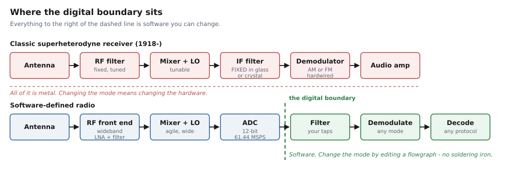
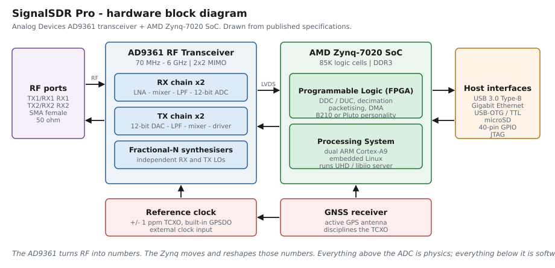
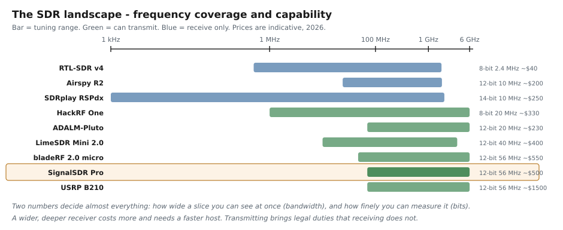
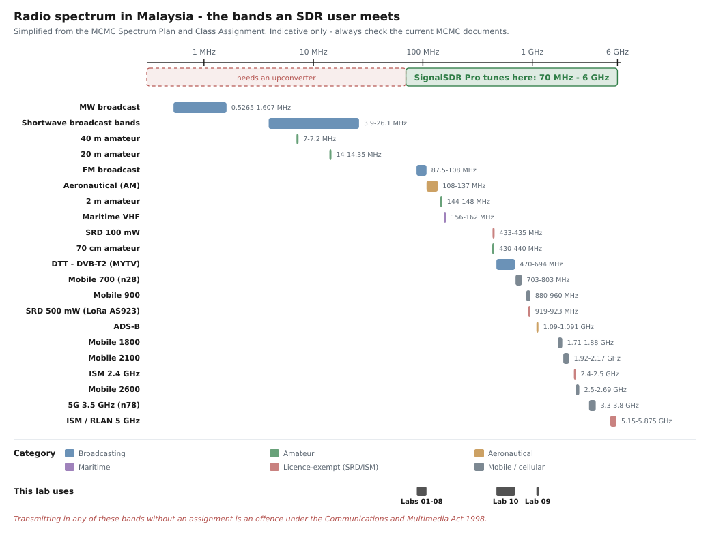

# 📻 Introduction to Software-Defined Radio

> **Start here.** No prior knowledge of radio, electronics or signal processing is assumed.
> **Time to read:** 45 minutes
> **Next:** [Setup](../00_setup/01_install_uhd.md) → [Fundamentals 01 — Signals & Systems](./01_signals_basics.md)

---

## Contents

1. [What is SDR?](#1-what-is-sdr)
2. [Why do we need SDR?](#2-why-do-we-need-sdr)
3. [The hardware: SignalSDR Pro](#3-the-hardware-signalsdr-pro)
4. [SDR software tools](#4-sdr-software-tools)
5. [Other SDRs, and how to choose](#5-other-sdrs-and-how-to-choose)
6. [Frequency allocation in Malaysia](#6-frequency-allocation-in-malaysia)
7. [Before you start: a short survival guide](#7-before-you-start-a-short-survival-guide)

---

## 1. What is SDR?

**Software-defined radio is a radio whose behaviour is determined by software rather than by
its circuitry.**

That sentence sounds abstract until you compare it with the alternative. For a century, a radio
was a chain of purpose-built hardware. To receive FM you built an FM receiver: a tuned circuit,
a mixer, an intermediate-frequency filter cut from a slab of quartz, a discriminator. To receive
AM instead, you built a *different* radio. The mode was welded into the metal.

An SDR replaces that chain with three things: **a wideband front end, an analogue-to-digital
converter, and a computer.**



The key is the **digital boundary** — the point where the signal stops being a voltage and
becomes a stream of numbers. Everything to the left of it is physics, fixed at manufacture.
Everything to the right is software you can change in an afternoon.

### What "software" actually does

Once the signal is numbers, the operations a radio performs become arithmetic:

| Radio function | In hardware | In software |
|---|---|---|
| Tuning | Variable capacitor, PLL | Multiply by a complex exponential |
| Filtering | Quartz crystal, ceramic filter | A weighted sum of recent samples ([Fund. 05](./05_sampling_and_filters.md)) |
| AM detection | Diode and capacitor | `abs(x)` |
| FM detection | Discriminator circuit | `angle(x[n] · conj(x[n-1]))` |
| Stereo decoding | PLL chip, analogue matrix | A few lines of DSP ([Lab 04](../02_flowgraphs/lab04_stereo_wbfm/README.md)) |
| Decoding a data protocol | A dedicated chip per protocol | A Python block |

**Nothing is simulated.** The signal really is being received; it is simply being processed with
arithmetic instead of components.

### The one-sentence version

> A conventional radio is a machine that does one thing. An SDR is a **general-purpose
> instrument** that becomes whatever radio you describe to it.

---

## 2. Why do we need SDR?

### 2.1 Because the alternative does not scale

A modern phone must handle 2G, 3G, 4G, 5G across a dozen bands, plus Wi-Fi, Bluetooth, GPS and
NFC. Building a separate hardware chain for each is impossible in the space and power available.
Sharing one wideband front end and switching the *software* is the only workable answer — which
is why every phone you have ever owned already contains an SDR.

### 2.2 Because standards change faster than hardware

DVB-T became DVB-T2. LTE became 5G NR. A broadcaster with software-defined transmitters upgrades
with a firmware push; one with fixed hardware replaces the estate. The same logic is why
satellites increasingly fly software-defined payloads: you cannot send an engineer to orbit, but
you can send a patch.

### 2.3 Because it collapses the cost of experimenting

This is the reason that matters to you.

| Instrument | Traditional cost | With an SDR |
|---|---|---|
| Spectrum analyser (to 6 GHz) | $20,000+ | included |
| Vector signal generator | $30,000+ | included |
| Protocol analyser, per protocol | $5,000+ each | a script |
| Aircraft / ship tracking receiver | $500 each | a flowgraph |
| Radio astronomy receiver | custom build | a flowgraph |

One $500 device replaces a laboratory's worth of single-purpose boxes. Not perfectly — a real
spectrum analyser has better dynamic range and calibrated absolute levels — but well enough that
**measurement stops being a budget question and becomes a knowledge question.**

### 2.4 Because it makes radio *legible*

This is the deepest reason, and the one this repository is built around.

In a hardware radio, the interesting parts are invisible. You cannot see the IF signal, or the
demodulator's output, or what the filter did. In an SDR **every intermediate stage is a variable
you can plot**. You can tap the signal between any two operations and look at it.

That is why the labs here progress the way they do: [Lab 01](../02_flowgraphs/lab01_simple_wbfm/README.md)
is an FM radio in three blocks, and by [Lab 08](../02_flowgraphs/lab08_rds_decoder/README.md) you
are pulling a station's name out of a subcarrier that a normal radio discards without telling
you. Nothing changed about the signal. What changed is that you could see it.

### 2.5 What SDR is *not* good at

Honesty matters more than enthusiasm:

- **Not the lowest noise.** A purpose-built receiver with a narrow front-end filter beats a
  wideband SDR on sensitivity and on resistance to strong nearby signals.
- **Not the lowest power.** A $2 FM receiver chip runs for a week on a coin cell. An SDR needs a
  computer.
- **Not free of latency.** USB, buffering and OS scheduling add milliseconds — fatal for some
  real-time control loops.
- **Not a shortcut past the theory.** The software will do exactly what you specify, including
  the wrong thing, silently.

---

## 3. The hardware: SignalSDR Pro

The [SignalSDR Pro](https://signalens.com/signalsdrpro/) by Signalens is the device this lab is
built around. It is roughly the size of a Raspberry Pi and pairs an **Analog Devices AD9361** RF
transceiver with an **AMD Zynq-7020** system-on-chip.



### 3.1 Specifications

| Parameter | Value |
|---|---|
| **Frequency range** | 70 MHz – 6 GHz |
| **RF bandwidth** | up to 56 MHz |
| **Sample rate** | up to 61.44 MSPS |
| **ADC / DAC resolution** | 12 bits |
| **Channels** | 2 × TX, 2 × RX (2×2 MIMO) |
| **Duplex** | Full duplex |
| **RF transceiver** | Analog Devices AD9361 |
| **SoC** | AMD (Xilinx) Zynq-7020, 85 K logic cells + dual ARM Cortex-A9 |
| **Reference clock** | ±1 ppm TCXO with **built-in GPSDO**; external reference input |
| **Host interfaces** | USB 3.0 Type-B, Gigabit Ethernet, USB-OTG, USB-TTL, JTAG, microSD |
| **Expansion** | 40-pin GPIO header |
| **Emulation** | **USRP B210** or **ADALM-Pluto** personality, loaded from the microSD card |

### 3.2 What the numbers mean in practice

Specifications are only useful once you can translate them.

**70 MHz – 6 GHz** covers FM broadcast, airband, VHF/UHF, ADS-B, GPS, Wi-Fi and 5G mid-band.
It does **not** cover HF — shortwave, most amateur bands, NDBs, time signals — for which you
need an upconverter. That gap is real and worth knowing before you go hunting for a signal at
7 MHz.

**56 MHz of bandwidth** is how wide a slice you can see at once. For comparison, one FM station
is 0.2 MHz and one DVB-T2 channel is 8 MHz, so you could watch an entire TV multiplex and its
neighbours simultaneously. In practice the host link limits you first: at 61.44 MSPS in 16-bit
complex format that is 246 MB/s, which is more than USB 3.0 will sustain in the real world.

**12 bits** gives a theoretical dynamic range of $6.02 \times 12 + 1.76 = 74$ dB
([Fundamentals 06](./06_noise_snr_and_gain.md)). That is the gap between the weakest signal you
can detect and the strongest you can tolerate at the same time — which matters enormously when a
100 kW FM transmitter sits three channels away from the 1 W signal you actually want.

**2 TX and 2 RX sharing one clock and one LO** is the specification that separates this from
cheaper devices. Coherent channels make phase interferometry, direction finding, MIMO and
passive radar possible at all — see
[Radar & Sensing](../04_applications/11_radar_and_sensing.md).

**The built-in GPSDO** disciplines the reference to GPS, giving sub-ppm frequency accuracy for
free. Most SDRs need an external unit for this. You can see it in the driver output when the
device starts:

```
[INFO] [B200] Detecting internal GPSDO....
[INFO] [GPS] Found an internal GPSDO: GPSTCXO v3.2 for SDRPro
```

### 3.3 The emulation trick

The Zynq's FPGA can present the device to the host as a **USRP B210** — a widely supported
Ettus Research product — or as an **ADALM-Pluto**. Because the personality lives in firmware on
the SD card, the SignalSDR Pro inherits the entire software ecosystem of whichever device it is
imitating, with no driver work at all.

**That is why this repository uses UHD.** Every flowgraph here talks to a "USRP B210", and every
tutorial, book and example written for a B210 works unchanged. See
[Setup 02](../00_setup/02_flash_b210_firmware.md).

### 3.4 Two things that will bite you

Both were discovered the hard way while building this lab, and both are documented where they
matter:

1. **Always set the analog filter bandwidth.** If you leave the USRP Source's `bw0` unset, the
   AD9361 opens its baseband filter to **56 MHz** and LO leakage swamps your signal. Measured on
   this device at 89.9 MHz: DC accounted for **84 %** of total power with `bw0` unset, versus
   **16 %** with it set to the sample rate. Fixing that one parameter improved Lab 03's measured
   audio SNR from 19.4 dB to **62.6 dB**. See [Fundamentals 06](./06_noise_snr_and_gain.md).
2. **Never tune directly onto the signal you want.** The LO leaks into the receiver and puts a
   permanent spike at exactly the tuned frequency. Tune beside your target and shift back in
   software. Measured cost of getting this wrong: **8.8 dB** of audio SNR
   ([Lab 06](../02_flowgraphs/lab06_multimode_receiver/README.md)).

---

## 4. SDR software tools

Hardware is the easy half. The software you choose shapes what you can do far more than the
device does.

### 4.1 Frameworks — for building your own radio

| Tool | Platform | Best for | Not for |
|---|---|---|---|
| **[GNU Radio](https://www.gnuradio.org/)** | Linux, macOS, Win | **Building signal processing from blocks.** What this repo uses throughout | Casual listening — it is a toolkit, not an app |
| **[GNU Radio Companion (GRC)](https://wiki.gnuradio.org/index.php/GNURadioCompanion)** | with GNU Radio | The graphical editor: drag blocks, press F5, it writes the Python | Anything needing tight loops or custom scheduling |
| **[MATLAB / Simulink](https://www.mathworks.com/products/instrument.html)** | all | Algorithm development, teaching, when you already have a licence | Cost; real-time deployment is harder |
| **[LabVIEW](https://www.ni.com/)** | Windows mainly | Instrumentation-style workflows, NI hardware | Cost, ecosystem lock-in |
| **[liquid-dsp](https://liquidsdr.org/)** | C library | Writing your own DSP in C, embedded targets | Beginners — no GUI, no scaffolding |
| **[SoapySDR](https://github.com/pothosware/SoapySDR)** | all | A vendor-neutral driver layer so one program supports many radios | It is plumbing, not an application |

### 4.2 General-purpose receivers — for listening and looking

| Tool | Platform | Best for | Not for |
|---|---|---|---|
| **[SDR++](https://www.sdrpp.org/)** | Linux, macOS, Win | The best modern general receiver. Fast, clean, cross-platform | Custom protocol decoding |
| **[SDRangel](https://www.sdrangel.org/)** | all | **Enormous** built-in decoder list: ADS-B, AIS, APRS, DAB, DVB, pagers, satellites | Simplicity — the UI is dense |
| **[GQRX](https://gqrx.dk/)** | Linux, macOS | Simple, dependable listening; built on GNU Radio | Windows users |
| **[SDR#](https://airspy.com/download/)** | Windows | The long-standing Windows default, huge plugin ecosystem | Non-Windows |
| **[CubicSDR](https://cubicsdr.com/)** | all | Clear visual spectrum browsing for newcomers | Advanced work |
| **[SDRuno](https://www.sdrplay.com/sdruno/)** | Windows | SDRplay hardware specifically | Other hardware |
| **[OpenWebRX](https://www.openwebrx.de/)** | Linux | Sharing a receiver over the web for others to use | Local low-latency work |

### 4.3 Analysis and reverse engineering

| Tool | Best for |
|---|---|
| **[inspectrum](https://github.com/miek/inspectrum)** | Visually dissecting a recorded IQ file — measuring symbol rates and pulse widths by eye. **Indispensable** for reverse engineering |
| **[Universal Radio Hacker (URH)](https://github.com/jopohl/urh)** | End-to-end protocol RE: demodulate, find the framing, guess the checksum, replay |
| **[SigDigger](https://github.com/BatchDrake/SigDigger)** | Signal inspection and analysis with a strong live focus |
| **[Baudline](https://www.baudline.com/)** | Deep spectral analysis of recorded signals |
| **[fosphor](https://sdr.osmocom.org/trac/wiki/fosphor)** | GPU-accelerated real-time spectrum/waterfall — a persistence display like a real analyser |
| **[IQEngine](https://www.iqengine.org/)** | Browsing and analysing IQ recordings in a web browser, nothing to install |

### 4.4 Purpose-built decoders

| Tool | Decodes | Used in this repo |
|---|---|---|
| **[rtl_433](https://github.com/merbanan/rtl_433)** | 200+ ISM-band sensors: weather stations, TPMS, doorbells | [IoT catalogue](../04_applications/08_iot_ism_and_short_range.md) |
| **[dump1090](https://github.com/antirez/dump1090) / [readsb](https://github.com/wiedehopf/readsb)** | ADS-B aircraft at 1090 MHz | [Lab 09](../02_flowgraphs/lab09_adsb_receiver/README.md) builds this from scratch |
| **[SatDump](https://github.com/SatDump/SatDump)** | Almost every weather and imaging satellite | [Satellite catalogue](../04_applications/04_satellite_and_space.md) |
| **[WSJT-X](https://wsjt.sourceforge.io/)** | FT8, WSPR, JT65 — weak-signal amateur modes | [Amateur catalogue](../04_applications/07_amateur_radio.md) |
| **[gr-gsm](https://github.com/ptrkrysik/gr-gsm)** | GSM control channels | [Cellular catalogue](../04_applications/09_cellular.md) |
| **[srsRAN](https://www.srslte.com/)** | LTE and 5G NR, receive and transmit | [Cellular catalogue](../04_applications/09_cellular.md) |
| **[gr-dtv](https://wiki.gnuradio.org/index.php/DTV)** | DVB-T/T2/S/S2, ATSC — **transmit** | [Lab 10](../02_flowgraphs/lab10_dvbt2_tx_rx/README.md) |
| **[radiosonde_auto_rx](https://github.com/projecthorus/radiosonde_auto_rx)** | Weather balloon telemetry | [Weather catalogue](../04_applications/05_weather_and_environment.md) |
| **[multimon-ng](https://github.com/EliasOenal/multimon-ng)** | POCSAG, FLEX, APRS, DTMF | [Land mobile catalogue](../04_applications/06_land_mobile_and_professional.md) |

### 4.5 Which should you use?

> **For this repository: GNU Radio, and nothing else.** Every lab is a GRC flowgraph.
>
> **Alongside it, install two things:** a general receiver (**SDR++** or **SDRangel**) so you can
> quickly *find* signals, and **inspectrum** so you can dissect recordings you have made.

The workflow that actually works is: **browse** with SDR++ → **record** with
[Lab 05](../02_flowgraphs/lab05_iq_record_playback/README.md) → **dissect** with inspectrum →
**build** the decoder in GNU Radio.

---

## 5. Other SDRs, and how to choose



> **A note on photographs.** This repository deliberately contains no product photos: they are
> copyrighted by their manufacturers. The diagram above is original work drawn from published
> specifications. **Every device name below links to its official page, where you will find
> photographs and full documentation.**

| Device | Range | BW | Bits | TX? | Indicative price | Best for |
|---|---|---|---|---|---|---|
| **[RTL-SDR v4](https://www.rtl-sdr.com/)** | 0.5 MHz – 1.766 GHz | 2.4 MHz | 8 | ✗ | ~$40 | **The best way to start.** Buy one even if you own something better — as a second receiver, or to lend |
| **[Airspy R2 / Mini](https://airspy.com/)** | 24 MHz – 1.8 GHz | 10 MHz | 12 | ✗ | ~$120–200 | Serious VHF/UHF listening; much better dynamic range than an RTL-SDR |
| **[SDRplay RSPdx](https://www.sdrplay.com/)** | 1 kHz – 2 GHz | 10 MHz | 14 | ✗ | ~$250 | **HF without an upconverter**, plus excellent filtering |
| **[HackRF One](https://greatscottgadgets.com/hackrf/)** | 1 MHz – 6 GHz | 20 MHz | 8 | ✓ half | ~$330 | Wide coverage and transmit on a budget; 8 bits limits weak-signal work |
| **[ADALM-Pluto](https://www.analog.com/en/resources/evaluation-hardware-and-software/evaluation-boards-kits/adalm-pluto.html)** | 70 MHz – 6 GHz | 20 MHz | 12 | ✓ full | ~$230 | Learning and teaching; same AD9361 family as the SignalSDR Pro |
| **[LimeSDR Mini 2.0](https://limemicro.com/)** | 10 MHz – 3.5 GHz | 40 MHz | 12 | ✓ full | ~$400 | Open hardware, strong FPGA story |
| **[bladeRF 2.0 micro](https://www.nuand.com/)** | 47 MHz – 6 GHz | 56 MHz | 12 | ✓ full | ~$550 | 2×2 MIMO, close competitor to this lab's hardware |
| **[SignalSDR Pro](https://signalens.com/signalsdrpro/)** | **70 MHz – 6 GHz** | **56 MHz** | **12** | ✓ full | ~$500 | **This lab.** 2×2 MIMO, GPSDO, embedded Linux, B210/Pluto emulation |
| **[USRP B210](https://www.ettus.com/all-products/ub210-kit/)** | 70 MHz – 6 GHz | 56 MHz | 12 | ✓ full | ~$1500 | The reference platform this one emulates |

### How to choose, in four questions

1. **Do you need to transmit?** If not, save the money and the legal exposure — receive-only
   devices are cheaper and better per dollar.
2. **Do you need HF (below 30 MHz)?** If yes, either buy an SDRplay / RTL-SDR with direct
   sampling, or budget for an upconverter.
3. **How wide a slice do you need at once?** One FM station needs 0.2 MHz. One DVB-T2 channel
   needs 8 MHz. Passive radar wants all you can get.
4. **Do you need two coherent channels?** Direction finding, MIMO and passive radar do. Almost
   nothing else does, and it roughly doubles the price.

> **A word on 8 bits versus 12.** This matters more than beginners expect. With 8 bits you get
> ~50 dB of dynamic range; with 12 you get ~74 dB. In a city where a broadcast transmitter is
> 60 dB stronger than the signal you want, that difference decides whether you hear anything at
> all.

---

## 6. Frequency allocation in Malaysia

Radio spectrum is a **regulated national resource**. In Malaysia it is administered by the
[Malaysian Communications and Multimedia Commission (MCMC / SKMM)](https://www.mcmc.gov.my/en/spectrum/spectrum-management)
under the Communications and Multimedia Act 1998.



> ⚠️ **This chart is a simplified orientation aid drawn from published MCMC documents — not a
> legal reference.** Allocations change. Always check the current
> [Spectrum Plan](https://www.mcmc.gov.my/skmmgovmy/media/General/MCMC-Spectrum-Plan-2022.pdf)
> and [Class Assignment](https://www.mcmc.gov.my/en/spectrum/assignment-of-spectrum/class-assignment)
> before relying on it.

### 6.1 The documents that matter

| Document | What it tells you |
|---|---|
| **[MCMC Spectrum Plan](https://www.mcmc.gov.my/skmmgovmy/media/General/MCMC-Spectrum-Plan-2022.pdf)** | The Malaysian Table of Frequency Allocations — which service owns which band |
| **[Class Assignment](https://www.mcmc.gov.my/en/spectrum/assignment-of-spectrum/class-assignment)** | Bands you may transmit in **without an individual licence**, and the power limits |
| **[Spectrum Assignment](https://www.mcmc.gov.my/en/spectrum/assignment-of-spectrum/spectrum-assignment)** | Who holds the licensed bands |
| **[Amateur Radio Service in Malaysia](https://www.mcmc.gov.my/skmmgovmy/media/General/pdf2/Amateur-Radio-Service-in-Malaysia-3rd-Edition_v1.pdf)** | Licensing, callsigns and the amateur band plan |

### 6.2 Licence-exempt bands (Class Assignment)

These are the only bands in which you may transmit without an individual assignment, and only
within the stated limits. **Figures are from the Class Assignment in force at the time of
writing — verify against the current edition**, which is revised periodically.

| Band | Limit | Typical use |
|---|---|---|
| **433 – 435 MHz** | 100 mW EIRP | Remote controls, sensors, [ISM devices](../04_applications/08_iot_ism_and_short_range.md) |
| 916 – 919 MHz | 25 mW EIRP, duty cycle < 1 % or FHSS or LBT | Low-duty telemetry |
| **919 – 923 MHz** | 500 mW EIRP | **LoRa (AS923)**, IoT, smart metering |
| 923 – 924 MHz | 500 mW EIRP, duty cycle < 1 % or FHSS or LBT | |
| **2400 – 2500 MHz** | 500 mW EIRP | Wi-Fi, Bluetooth, Zigbee |
| 5 GHz RLAN bands | per Class Assignment | Wi-Fi 5/6 |

> **Note for readers used to Europe or the USA:** Malaysia's 900 MHz SRD band is
> **919–923 MHz**, not 868 MHz (Europe) or 915 MHz (Americas). A European LoRa node will be
> transmitting out of band here. This is exactly the kind of regional difference the
> [IoT catalogue](../04_applications/08_iot_ism_and_short_range.md) warns about.

### 6.3 Bands relevant to this lab

| Band | Service in Malaysia | Where it appears here |
|---|---|---|
| 87.5 – 108 MHz | FM broadcasting | [Labs 01–08](../02_flowgraphs/lab01_simple_wbfm/README.md). The verification signal for this repo was **BFM 89.9**, Kuala Lumpur |
| 108 – 137 MHz | Aeronautical (AM voice, VOR/ILS) | [Lab 06](../02_flowgraphs/lab06_multimode_receiver/README.md) |
| 144 – 148 MHz | Amateur 2 m | [Amateur catalogue](../04_applications/07_amateur_radio.md) |
| 156 – 162 MHz | Maritime VHF, AIS | [Maritime catalogue](../04_applications/03_maritime.md) |
| 430 – 440 MHz | Amateur 70 cm | |
| **470 – 694 MHz** | **DTT — DVB-T2 (MYTV / MyFreeview)** | [Lab 10](../02_flowgraphs/lab10_dvbt2_tx_rx/README.md) |
| 703 – 803 MHz | Mobile 700 MHz (refarmed after analogue switch-off) | [Cellular catalogue](../04_applications/09_cellular.md) |
| 1090 MHz | ADS-B aircraft transponders | [Lab 09](../02_flowgraphs/lab09_adsb_receiver/README.md) |
| 1575.42 MHz | GPS L1 | [Navigation catalogue](../04_applications/10_navigation_and_timing.md) |
| 3.3 – 3.8 GHz | 5G mid-band (n78) | |

> 🎯 **A happy coincidence for Lab 10:** Malaysia switched off analogue television on
> **31 October 2019** and runs DTT entirely on **DVB-T2**. That means essentially every
> television sold here has a DVB-T2 tuner built in — which is exactly the receiver
> [Lab 10](../02_flowgraphs/lab10_dvbt2_tx_rx/README.md) needs. **You must still transmit only
> inside a Faraday cage or over a cable**, and never on a channel MYTV is using.

### 6.4 Transmitting legally in Malaysia

- **Receiving** broadcast radio and television is unrestricted. Other services vary — see the
  law-and-ethics section of [Part 4](../04_applications/README.md#-law--ethics).
- **Transmitting** requires an assignment, except within the Class Assignment limits above.
- The realistic route to legal transmission is an **amateur radio licence**. MCMC administers
  the examination and callsign assignment; Malaysian amateurs hold **9M2**, **9M4**, **9W2**
  and **9W6**-series callsigns depending on class and region. Start with the
  [Amateur Radio Service guide](https://www.mcmc.gov.my/skmmgovmy/media/General/pdf2/Amateur-Radio-Service-in-Malaysia-3rd-Edition_v1.pdf),
  and look up **MARTS** (Malaysian Amateur Radio Transmitters' Society) and **MARES** for
  classes and local activity.

> ⛔ **Transmitting without an assignment is an offence under the Communications and Multimedia
> Act 1998.** Your SignalSDR Pro can transmit from 70 MHz to 6 GHz — including aviation, maritime
> distress and cellular bands — if you tell it to. Nine of this repository's ten labs are
> receive-only for exactly this reason.

---

## 7. Before you start: a short survival guide

### 7.1 The antenna matters more than the radio

If you remember one thing: **a $40 receiver with a good, resonant, outdoor antenna will
comprehensively beat a $1500 receiver with the wrong antenna indoors.**

$$
\text{quarter-wave length (mm)} = \frac{75{,}000}{f_{\text{MHz}}}
$$

| Band | Frequency | ¼-wave |
|---|---|---|
| FM broadcast | 98 MHz | 765 mm |
| Airband | 127 MHz | 590 mm |
| 2 m / marine | 145 MHz | 517 mm |
| 70 cm | 435 MHz | 172 mm |
| ADS-B | 1090 MHz | **69 mm** |
| GPS | 1575 MHz | 48 mm |

Measured in this lab: zero ADS-B frames were received at 1090 MHz using an FM-band whip, and the
noise floor rose 1 dB for every 1 dB of gain — the signature of a receiver that is hearing only
itself. The antenna was the entire problem.

### 7.2 Units you will meet on day one

| Unit | Means | Remember |
|---|---|---|
| dB | Power ratio | **Power → 10·log₁₀. Voltage → 20·log₁₀.** Getting this wrong is the most common beginner error |
| dBm | Power vs 1 mW | 0 dBm = 1 mW; −90 dBm is a typical usable broadcast signal |
| dBFS | Level vs ADC full scale | What your SDR actually reports. Aim for −30 to −10 dBFS |
| MSPS | Mega-samples per second | For complex IQ, this equals the bandwidth in MHz |
| ppm | Parts per million | Clock accuracy. 1 ppm at 1 GHz = 1 kHz of error |

### 7.3 The five mistakes everyone makes

1. **Turning the gain all the way up.** Past a point you amplify only noise and create
   intermodulation. Raise gain until the *noise floor* starts rising with it, then back off 5 dB.
2. **Tuning directly onto the signal.** The DC/LO spike lands on top of it. Offset and shift back.
3. **Forgetting the anti-alias filter before decimating.** Aliased signals are arithmetically
   indistinguishable from real ones, forever.
4. **Debugging against a live signal.** If it changes between runs you cannot tell whether your
   fix worked. Record it ([Lab 05](../02_flowgraphs/lab05_iq_record_playback/README.md)).
5. **Blaming the software.** It is usually the antenna, the gain, or the fact that nothing is
   transmitting right now.

### 7.4 Where to go from here

```
  You are here
       │
       ▼
  00_setup/           get UHD and GNU Radio working, verify the device
       │
       ▼
  01_fundamentals/    01-04 before Lab 01; 05-11 as the labs call for them
       │
       ▼
  02_flowgraphs/      Lab 01 (3 blocks) ──▶ Lab 10 (a TV transmitter)
       │
       ▼
  04_applications/    589 things to point it at
```

**Next:** [Setup 01 — Installing UHD →](../00_setup/01_install_uhd.md)

---

## 📖 References

1. [Signalens — SignalSDR Pro](https://signalens.com/signalsdrpro/) · [GitHub](https://github.com/signalens/signalsdrpro/)
2. [Analog Devices AD9361](https://www.analog.com/en/products/ad9361.html)
3. [MCMC Spectrum Plan 2022](https://www.mcmc.gov.my/skmmgovmy/media/General/MCMC-Spectrum-Plan-2022.pdf) · [Class Assignment](https://www.mcmc.gov.my/en/spectrum/assignment-of-spectrum/class-assignment)
4. [Amateur Radio Service in Malaysia (MCMC)](https://www.mcmc.gov.my/skmmgovmy/media/General/pdf2/Amateur-Radio-Service-in-Malaysia-3rd-Edition_v1.pdf)
5. [GNU Radio](https://www.gnuradio.org/) · [GNU Radio wiki](https://wiki.gnuradio.org/)
6. [Signal Identification Wiki](https://www.sigidwiki.com/) — what is that signal?
7. [RTL-SDR.com](https://www.rtl-sdr.com/) — the best-maintained news source in the hobby

---

*Diagrams in this document are original work, generated by
[`03_scripts/make_diagrams.py`](../03_scripts/make_diagrams.py) from published specifications.*
