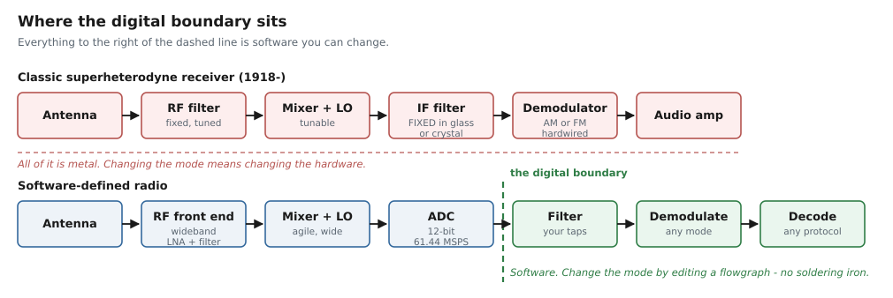
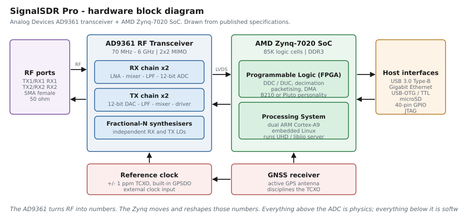
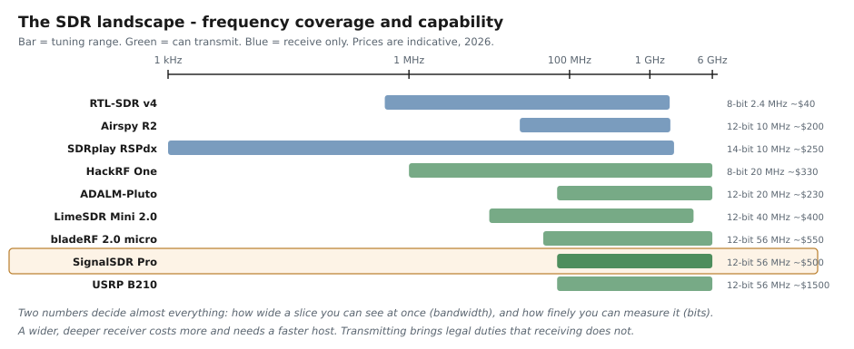
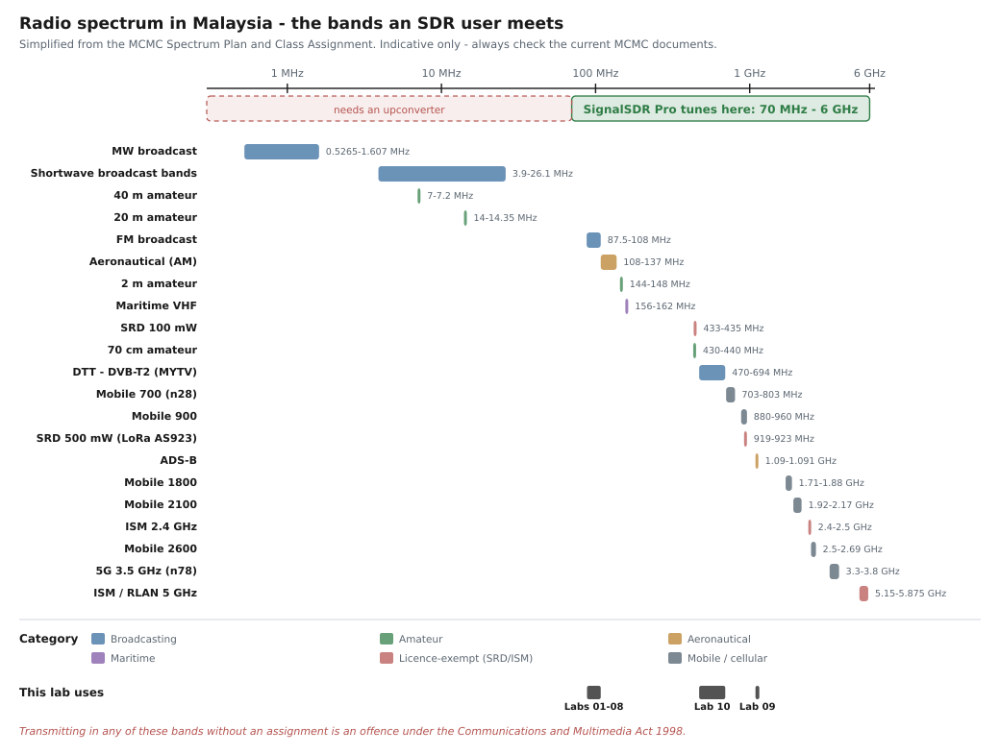

# 📻 Introduction to Software-Defined Radio

> **What you will learn:** what an SDR is, why it is useful, what is inside the SignalSDR Pro,
> which software to use, how it compares with other SDRs, and which radio bands you may use in
> Malaysia.
> **Before this:** nothing. No knowledge of radio, electronics or maths is needed.
> (Want to hear a station first? Do [Your First 30 Minutes](../QUICKSTART.md).)
> **Time:** about 45 minutes.

---

## Contents

1. [What is SDR?](#1-what-is-sdr)
2. [Why do we need SDR?](#2-why-do-we-need-sdr)
3. [The hardware: SignalSDR Pro](#3-the-hardware-signalsdr-pro)
4. [SDR software tools](#4-sdr-software-tools)
5. [Other SDRs, and how to choose](#5-other-sdrs-and-how-to-choose)
6. [Frequency allocation in Malaysia](#6-frequency-allocation-in-malaysia)
7. [Before you start: a short survival guide](#7-before-you-start-a-short-survival-guide)

---

## 1. What is SDR?

**A software-defined radio (SDR) is a radio where software decides what the radio does.**

### The old way: one radio, one job

Think of the radios you already know: a car radio, a walkie-talkie, a TV. Each one is built
from electronic parts chosen for **one job**.

- An FM radio has parts that only understand FM.
- An AM radio needs *different* parts.
- A walkie-talkie needs different parts again.

To change what the radio does, you must change the hardware. In practice, you buy another
radio.

### The new way: one radio, any job

An SDR has only three main parts:

1. **A wideband front end** — electronics that catch a wide range of radio frequencies.
2. **An analog-to-digital converter (ADC)** — a chip that measures the radio signal millions
   of times per second and turns each measurement into a number.
3. **A computer** — which does everything else, using software.



The important idea is the **digital boundary**. That is the point where the signal stops being
an electrical voltage and becomes a list of numbers.

- **Before the boundary:** physical electronics. It was fixed when the radio was made.
- **After the boundary:** software. You can change it any time, in minutes.

### What the software does

Once the signal is numbers, every job a radio does becomes simple arithmetic:

| Radio job | In a normal radio (hardware) | In an SDR (software) |
|---|---|---|
| Tuning to a station | A variable capacitor or a tuning chip | Multiply the numbers by a spinning "wheel" of numbers ([Fundamentals 02](./02_iq_sampling.md)) |
| Filtering out other stations | A quartz crystal or ceramic filter | A weighted average of the most recent numbers ([Fundamentals 05](./05_sampling_and_filters.md)) |
| Getting sound from AM | A diode and a capacitor | `abs(x)` — the size of each number |
| Getting sound from FM | A "discriminator" circuit | `angle(x[n] · conj(x[n-1]))` — how fast the signal turns |
| Stereo | A special chip | A few lines of code ([Lab 04](../02_flowgraphs/lab04_stereo_wbfm/README.md)) |
| Reading a data signal | A special chip for each type | A small Python program |

Don't worry if the formulas mean nothing yet. The point is that each hardware part becomes a
few lines of code.

> 💡 **This is not a simulation.** The SDR really receives real radio signals. It just
> processes them with arithmetic instead of with electronic parts.

### In one sentence

> A normal radio is a machine that does one job. An SDR is a **general-purpose tool** that
> becomes whatever radio you describe in software.

---

## 2. Why do we need SDR?

### 2.1 One device must do many jobs

A modern mobile phone must handle 2G, 3G, 4G and 5G on many frequency bands, plus Wi-Fi,
Bluetooth, GPS and NFC. There is no room inside a phone for a separate radio for each one.
So phones use one shared wideband radio and switch the software. **Every mobile phone you
have owned already contains an SDR.**

### 2.2 Standards change faster than hardware

Digital TV changed from DVB-T to DVB-T2. Mobile networks changed from 4G (LTE) to 5G.
With software-defined equipment, an upgrade is a software update. With fixed hardware, you
must replace the equipment.

Satellites use SDR for the same reason. You cannot send an engineer into space to change a
part, but you *can* send a software update.

### 2.3 It makes experiments cheap

This is the reason that matters most to you. One SDR can replace many expensive instruments:

| Instrument | Usual price | With an SDR |
|---|---|---|
| Spectrum analyser (up to 6 GHz) | $20,000+ | included |
| Signal generator | $30,000+ | included |
| Protocol analyser, for each protocol | $5,000+ each | a script |
| Aircraft or ship tracking receiver | $500 each | a flowgraph |
| Radio astronomy receiver | custom-built | a flowgraph |

An SDR is not as accurate as a real lab instrument. A real spectrum analyser can handle
stronger and weaker signals at the same time, and it tells you the exact power in watts. But an
SDR is good enough for learning and for most projects. So the question changes from
"can I afford the equipment?" to "do I know how to do it?"

### 2.4 You can *see* inside the radio

In a normal radio, you cannot see what happens inside. You cannot watch the signal after the
filter, or after the decoder.

In an SDR, **every step is data you can plot on screen.** You can look at the signal between
any two steps.

That is why the labs in this course work the way they do. In
[Lab 01](../02_flowgraphs/lab01_simple_wbfm/README.md) you build an FM radio from three blocks.
By [Lab 08](../02_flowgraphs/lab08_rds_decoder/README.md) you read a station's name from a
hidden data signal inside the broadcast. A normal FM radio throws that signal away. The signal
was always there — the SDR simply lets you see it.

### 2.5 What SDR is *not* good at

An SDR is not the best tool for every job:

- **Not the quietest.** A radio built for one frequency has a narrow filter at its input. It
  hears weak signals better, and it is less upset by strong signals nearby.
- **Not low power.** A $2 FM radio chip can run for a week on a coin battery. An SDR needs a
  computer.
- **Not instant.** USB, buffers and the operating system add a few milliseconds of delay.
  That is too slow for some fast control systems.
- **Not a shortcut past learning.** The software does exactly what you tell it — including
  the wrong thing — and it will not warn you.

---

## 3. The hardware: SignalSDR Pro

The [SignalSDR Pro](https://signalens.com/signalsdrpro/) is made by **Signalens**. It is about
the size of a Raspberry Pi. It has two main chips:

- **Analog Devices AD9361** — the **RF transceiver**. "RF" means radio frequency.
  "Transceiver" means it can both **trans**mit and re**ceive**. This chip does the radio part:
  it tunes, amplifies, filters, and converts between radio waves and numbers.
- **AMD (Xilinx) Zynq-7020** — a **system-on-chip**. It contains an **FPGA** (a chip whose
  circuits can be reprogrammed) and two small ARM processors that run Linux. It moves the data
  between the radio chip and your computer.



### 3.1 Specifications

| Parameter | Value |
|---|---|
| **Frequency range** | 70 MHz – 6 GHz |
| **Bandwidth** (how wide a slice it sees at once) | up to 56 MHz |
| **Sample rate** (measurements per second) | up to 61.44 million per second (61.44 MSPS) |
| **ADC / DAC resolution** | 12 bits |
| **Channels** | 2 transmit, 2 receive (called "2×2 MIMO") |
| **Duplex** | Full duplex — it can transmit and receive at the same time |
| **RF transceiver** | Analog Devices AD9361 |
| **System-on-chip** | AMD (Xilinx) Zynq-7020: 85,000 logic cells + two ARM Cortex-A9 cores |
| **Reference clock** | ±1 ppm crystal, with a **built-in GPS clock (GPSDO)**, and an input for an external clock |
| **Connections to a computer** | USB 3.0 Type-B, Gigabit Ethernet, USB-OTG, USB serial console, JTAG, microSD |
| **Expansion** | 40-pin GPIO header |
| **Emulation** | Can act as a **USRP B210** or an **ADALM-Pluto**, chosen by the software on the microSD card |

### 3.2 What the numbers mean in practice

A specification is only useful if you know what it means in practice.

**70 MHz – 6 GHz.** This covers FM radio, aircraft radio, VHF and UHF two-way radio, aircraft
tracking (ADS-B), GPS, Wi-Fi and 5G.

It does **not** cover **HF** (below 30 MHz): shortwave radio, most amateur bands, and time
signals. For those you need an extra device called an **upconverter**. Remember this before you
go looking for a signal at 7 MHz.

**56 MHz bandwidth.** This is how wide a slice of spectrum you can see at one time. One FM
station is 0.2 MHz wide. One DVB-T2 TV channel is 8 MHz wide. So you could watch a whole TV
channel and its neighbours at once.

In practice, USB limits you first. At 61.44 million samples per second, with 16-bit I and Q
values (4 bytes per sample), the data rate is 246 MB/s. That is more than USB 3.0 can
reliably carry.

**12 bits.** Each measurement is a number with 12 binary digits: 4,096 possible levels. This
sets the **dynamic range** — the gap between the weakest and the strongest signal the radio
can handle *at the same moment*. For 12 bits, it is about **74 dB** (that is, the strongest
signal can be about 25 million times more powerful than the weakest). This matters a lot in a
city. A 100 kW FM transmitter nearby may be millions of times stronger than the 1 W signal you
want to hear.

<details>
<summary><b>Going deeper:</b> where 74 dB comes from</summary>

For an ideal ADC with $N$ bits, the best possible signal-to-noise ratio for a full-scale sine
wave is:

$$\text{SNR} = 6.02 \times N + 1.76 \text{ dB}$$

For $N = 12$: $6.02 \times 12 + 1.76 = 74$ dB. Each extra bit adds about 6 dB.
See [Fundamentals 06](./06_noise_snr_and_gain.md).
</details>

**2 transmit and 2 receive channels on one shared clock.** Cheaper SDRs do not have this.
Because both receive channels use the same clock and the same tuner, you can compare them
exactly. That makes advanced projects possible: finding the direction a signal comes from,
MIMO (multiple antennas at once), and passive radar. See
[Radar & Sensing](../04_applications/11_radar_and_sensing.md).

**Built-in GPS clock (GPSDO).** The radio's frequency accuracy depends on its internal clock.
A **GPSDO** (GPS-disciplined oscillator) uses GPS satellites to correct that clock, so the
radio's frequency is extremely accurate. Most SDRs need an extra box for this. You can see it
in the driver messages when the radio starts:

```
[INFO] [B200] Detecting internal GPSDO....
[INFO] [GPS] Found an internal GPSDO: GPSTCXO v3.2 for SDRPro
```

### 3.3 The emulation trick

The SignalSDR Pro can **pretend** to be another radio. Its FPGA can make it look, to your
computer, exactly like:

- a **USRP B210** (a well-known radio made by Ettus Research), or
- an **ADALM-Pluto** (a learning radio made by Analog Devices).

Which one it pretends to be depends on the software on its microSD card. Because it looks
exactly like the real thing, all the software written for that radio works without any changes.

**That is why this course uses UHD.** UHD is the driver for USRP radios. Every flowgraph here
talks to a "USRP B210", and every tutorial, book and example written for the B210 works on
your SignalSDR Pro. See [Setup 02](../00_setup/02_flash_b210_firmware.md).

### 3.4 Two common problems, and how to avoid them

Both problems were found while testing this course on a real SignalSDR Pro.

**1. Always set the analog filter bandwidth.**

The radio has a hardware filter before the ADC. In GNU Radio's USRP Source block, its setting
is called `bw0`. If you leave it empty, the filter opens to its widest setting, **56 MHz**.
Then a lot of unwanted energy gets in — mostly a big spike at the centre of the screen.

Measured at 89.9 MHz: with `bw0` empty, that spike was **84 %** of everything the radio
received. With `bw0` set to the sample rate, it was only **16 %**. In Lab 03, this one setting
improved the audio quality (SNR) from 19.4 dB to **62.6 dB**. That is the difference between
hissy and clean. See [Fundamentals 06](./06_noise_snr_and_gain.md).

**2. Don't tune exactly onto the station you want.**

Every SDR shows a small spike exactly at the centre frequency. It is the radio's own tuning
signal leaking into its input. If you tune exactly onto a station, the spike sits on top of it.

Instead, tune a little to one side, then shift the station back to the centre in software.
Measured cost of *not* doing this: **8.8 dB** worse audio
([Lab 06](../02_flowgraphs/lab06_multimode_receiver/README.md)).

---

## 4. SDR software tools

The hardware is only half the story. The software you choose decides what you can do.
This section is a map. **You only need GNU Radio for this course.**

### 4.1 Frameworks — for building your own radio

| Tool | Runs on | Good for | Not good for |
|---|---|---|---|
| **[GNU Radio](https://www.gnuradio.org/)** | Linux, macOS, Windows | **Building radios from blocks.** Used for every lab in this course | Just listening — it is a toolkit, not a ready-made app |
| **[GNU Radio Companion (GRC)](https://wiki.gnuradio.org/index.php/GNURadioCompanion)** | comes with GNU Radio | The drawing editor: drag blocks, connect them, press F5. It writes the Python for you | Very complex or unusual programs |
| **[MATLAB / Simulink](https://www.mathworks.com/products/instrument.html)** | all | Designing and testing algorithms, if you already have a licence | Cost; harder to run in real time |
| **[LabVIEW](https://www.ni.com/)** | mainly Windows | Test-equipment style work, NI hardware | Cost; ties you to one company |
| **[liquid-dsp](https://liquidsdr.org/)** | C library | Writing your own signal processing in C | Beginners — no graphical tools |
| **[SoapySDR](https://github.com/pothosware/SoapySDR)** | all | One driver layer that works with many brands of radio | It is a building block, not an app |

### 4.2 Receiver apps — for listening and looking

| Tool | Runs on | Good for | Not good for |
|---|---|---|---|
| **[SDR++](https://www.sdrpp.org/)** | Linux, macOS, Windows | The best modern general receiver. Fast and clean | Decoding unusual data signals |
| **[SDRangel](https://www.sdrangel.org/)** | all | A **very** long list of built-in decoders: aircraft, ships, digital radio, TV, satellites | Simplicity — the screen is busy |
| **[GQRX](https://gqrx.dk/)** | Linux, macOS | Simple, reliable listening. Built on GNU Radio | Windows |
| **[SDR#](https://airspy.com/download/)** | Windows | The long-time Windows favourite, with many plugins | Linux and macOS |
| **[CubicSDR](https://cubicsdr.com/)** | all | Easy, visual browsing for beginners | Advanced work |
| **[SDRuno](https://www.sdrplay.com/sdruno/)** | Windows | SDRplay radios | Other radios |
| **[OpenWebRX](https://www.openwebrx.de/)** | Linux | Sharing your receiver with others over the web | Local, low-delay work |

### 4.3 Analysis tools — for studying recorded signals

| Tool | Good for |
|---|---|
| **[inspectrum](https://github.com/miek/inspectrum)** | Looking closely at a recorded signal file. Measure pulse widths and data speeds by eye. **Very useful** for understanding unknown signals |
| **[Universal Radio Hacker (URH)](https://github.com/jopohl/urh)** | Working out an unknown data signal from start to end: decode it, find its structure, test it |
| **[SigDigger](https://github.com/BatchDrake/SigDigger)** | Looking at and analysing live signals |
| **[Baudline](https://www.baudline.com/)** | Detailed frequency analysis of recordings |
| **[fosphor](https://sdr.osmocom.org/trac/wiki/fosphor)** | A very fast spectrum and waterfall display, using the graphics card |
| **[IQEngine](https://www.iqengine.org/)** | Viewing signal recordings in a web browser — nothing to install |

### 4.4 Ready-made decoders — for one type of signal each

| Tool | Decodes | Where it appears in this course |
|---|---|---|
| **[rtl_433](https://github.com/merbanan/rtl_433)** | 200+ small wireless sensors: weather stations, tyre-pressure sensors, doorbells | [IoT catalogue](../04_applications/08_iot_ism_and_short_range.md) |
| **[dump1090](https://github.com/antirez/dump1090) / [readsb](https://github.com/wiedehopf/readsb)** | Aircraft positions (ADS-B) at 1090 MHz | [Lab 09](../02_flowgraphs/lab09_adsb_receiver/README.md) builds this yourself |
| **[SatDump](https://github.com/SatDump/SatDump)** | Pictures from almost every weather satellite | [Satellite catalogue](../04_applications/04_satellite_and_space.md) |
| **[WSJT-X](https://wsjt.sourceforge.io/)** | FT8, WSPR, JT65 — amateur radio modes for very weak signals | [Amateur catalogue](../04_applications/07_amateur_radio.md) |
| **[gr-gsm](https://github.com/ptrkrysik/gr-gsm)** | 2G (GSM) mobile control channels | [Cellular catalogue](../04_applications/09_cellular.md) |
| **[srsRAN](https://www.srslte.com/)** | 4G (LTE) and 5G, receive and transmit | [Cellular catalogue](../04_applications/09_cellular.md) |
| **[gr-dtv](https://wiki.gnuradio.org/index.php/DTV)** | Digital TV (DVB-T/T2/S/S2, ATSC) — **transmit** | [Lab 10](../02_flowgraphs/lab10_dvbt2_tx_rx/README.md) |
| **[radiosonde_auto_rx](https://github.com/projecthorus/radiosonde_auto_rx)** | Weather balloon data | [Weather catalogue](../04_applications/05_weather_and_environment.md) |
| **[multimon-ng](https://github.com/EliasOenal/multimon-ng)** | Pagers (POCSAG, FLEX), APRS, phone tones (DTMF) | [Land mobile catalogue](../04_applications/06_land_mobile_and_professional.md) |

### 4.5 So which should you install?

> **For this course: GNU Radio.** Every lab is a GNU Radio Companion flowgraph.
>
> **Later, add two more:** a receiver app (**SDR++** or **SDRangel**) to quickly *find*
> signals, and **inspectrum** to study signals you have recorded.

A good way to work with an unknown signal:

```
  find it with SDR++  →  record it (Lab 05)  →  study it in inspectrum  →  build a decoder in GNU Radio
```

---

## 5. Other SDRs, and how to choose



> **Why there are no product photos.** Product photos belong to their makers, so this
> repository does not copy them. The diagram above was drawn for this course from published
> specifications. **Each name below links to the maker's page**, where you can see photos
> and full details.

| Device | Frequency range | Bandwidth | Bits | Can transmit? | Rough price | Best for |
|---|---|---|---|---|---|---|
| **[RTL-SDR v4](https://www.rtl-sdr.com/)** | 0.5 MHz – 1.766 GHz | 2.4 MHz | 8 | ✗ | ~$40 | **The best way to start.** Worth having even if you own a better one — as a second receiver, or to lend to a friend |
| **[Airspy R2 / Mini](https://airspy.com/)** | 24 MHz – 1.8 GHz | 10 MHz | 12 | ✗ | ~$120–200 | Serious VHF/UHF listening; handles strong signals much better than an RTL-SDR |
| **[SDRplay RSPdx](https://www.sdrplay.com/)** | 1 kHz – 2 GHz | 10 MHz | 14 | ✗ | ~$250 | **Shortwave (HF) with no extra device**, and very good filters |
| **[HackRF One](https://greatscottgadgets.com/hackrf/)** | 1 MHz – 6 GHz | 20 MHz | 8 | ✓ one way at a time | ~$330 | Wide range and transmit on a budget; 8 bits limits weak-signal work |
| **[ADALM-Pluto](https://www.analog.com/en/resources/evaluation-hardware-and-software/evaluation-boards-kits/adalm-pluto.html)** | 70 MHz – 6 GHz | 20 MHz | 12 | ✓ both at once | ~$230 | Learning and teaching; same chip family as the SignalSDR Pro |
| **[LimeSDR Mini 2.0](https://limemicro.com/)** | 10 MHz – 3.5 GHz | 40 MHz | 12 | ✓ both at once | ~$400 | Open-source hardware, good FPGA support |
| **[bladeRF 2.0 micro](https://www.nuand.com/)** | 47 MHz – 6 GHz | 56 MHz | 12 | ✓ both at once | ~$550 | Two channels; the closest rival to the SignalSDR Pro |
| **[SignalSDR Pro](https://signalens.com/signalsdrpro/)** | **70 MHz – 6 GHz** | **56 MHz** | **12** | ✓ both at once | ~$500 | **This course.** Two channels, GPS clock, built-in Linux, acts as a B210 or Pluto |
| **[USRP B210](https://www.ettus.com/all-products/ub210-kit/)** | 70 MHz – 6 GHz | 56 MHz | 12 | ✓ both at once | ~$1500 | The well-known radio the SignalSDR Pro imitates |

### Choosing, in four questions

1. **Do you need to transmit?** If not, a receive-only SDR is cheaper, better value, and has
   no legal risk.
2. **Do you need shortwave (below 30 MHz)?** If yes, get an SDRplay, or an RTL-SDR that
   supports "direct sampling", or plan to buy an upconverter.
3. **How wide a slice do you need to see at once?** One FM station needs 0.2 MHz. One DVB-T2
   TV channel needs 8 MHz. Passive radar wants as much as possible.
4. **Do you need two channels on one clock?** Direction finding, MIMO and passive radar do.
   Almost nothing else does, and it roughly doubles the price.

> 💡 **8 bits or 12 bits?** This matters more than beginners expect. 8 bits gives about
> 50 dB of dynamic range; 12 bits gives about 74 dB. In a city, a nearby broadcast station can
> be 60 dB stronger (a million times more powerful) than the signal you want. With 8 bits,
> the strong station can make the weak one impossible to hear.

---

## 6. Frequency allocation in Malaysia

Radio frequencies are shared by everyone, so the government controls who may use which ones.
In Malaysia, this is done by the
[Malaysian Communications and Multimedia Commission (MCMC, or SKMM in Malay)](https://www.mcmc.gov.my/en/spectrum/spectrum-management),
under the Communications and Multimedia Act 1998.



> ⚠️ **This chart is a simplified guide, not a legal document.** It was drawn from MCMC's
> published documents. The rules change. Always check the current
> [Spectrum Plan](https://www.mcmc.gov.my/skmmgovmy/media/General/MCMC-Spectrum-Plan-2022.pdf)
> and [Class Assignment](https://www.mcmc.gov.my/en/spectrum/assignment-of-spectrum/class-assignment)
> before you rely on it.

### 6.1 The important documents

| Document | What it tells you |
|---|---|
| **[MCMC Spectrum Plan](https://www.mcmc.gov.my/skmmgovmy/media/General/MCMC-Spectrum-Plan-2022.pdf)** | Which service (TV, mobile, aircraft…) owns which frequencies in Malaysia |
| **[Class Assignment](https://www.mcmc.gov.my/en/spectrum/assignment-of-spectrum/class-assignment)** | Frequencies you may transmit on **without your own licence**, and the power limits |
| **[Spectrum Assignment](https://www.mcmc.gov.my/en/spectrum/assignment-of-spectrum/spectrum-assignment)** | Who holds the licence for each band |
| **[Amateur Radio Service in Malaysia](https://www.mcmc.gov.my/skmmgovmy/media/General/pdf2/Amateur-Radio-Service-in-Malaysia-3rd-Edition_v1.pdf)** | Amateur (ham) radio licences, callsigns and bands |

### 6.2 Bands you may use without a licence (Class Assignment)

These are the only bands where you may transmit without your own licence — and only within
the limits shown. **These figures are from the Class Assignment at the time of writing. Check
the current edition**, because it is updated from time to time.

"EIRP" means the total power that leaves the antenna, including the antenna's own gain.

| Band | Power limit | Typical use |
|---|---|---|
| **433 – 435 MHz** | 100 mW EIRP | Remote controls, sensors, [small wireless devices](../04_applications/08_iot_ism_and_short_range.md) |
| 916 – 919 MHz | 25 mW EIRP, and must transmit less than 1 % of the time (or use frequency hopping or listen-before-talk) | Low-rate data |
| **919 – 923 MHz** | 500 mW EIRP | **LoRa (AS923)**, IoT, smart meters |
| 923 – 924 MHz | 500 mW EIRP, and less than 1 % of the time (or hopping or listen-before-talk) | |
| **2400 – 2500 MHz** | 500 mW EIRP | Wi-Fi, Bluetooth, Zigbee |
| 5 GHz Wi-Fi bands | as set in the Class Assignment | Wi-Fi 5 and 6 |

> 💡 **If you learned from European or American guides:** Malaysia's 900 MHz band for small
> devices is **919–923 MHz**. It is *not* 868 MHz (Europe) or 915 MHz (USA). A LoRa device
> made for Europe would transmit on the wrong frequency here. The
> [IoT catalogue](../04_applications/08_iot_ism_and_short_range.md) explains more.

### 6.3 Bands used in this course

| Band | What uses it in Malaysia | Where you meet it |
|---|---|---|
| 87.5 – 108 MHz | FM radio | [Labs 01–08](../02_flowgraphs/lab01_simple_wbfm/README.md). This course was tested on **BFM 89.9**, Kuala Lumpur |
| 108 – 137 MHz | Aircraft (AM voice, navigation beacons) | [Lab 06](../02_flowgraphs/lab06_multimode_receiver/README.md) |
| 144 – 148 MHz | Amateur radio, "2 m" band | [Amateur catalogue](../04_applications/07_amateur_radio.md) |
| 156 – 162 MHz | Marine VHF radio, ship tracking (AIS) | [Maritime catalogue](../04_applications/03_maritime.md) |
| 430 – 440 MHz | Amateur radio, "70 cm" band | |
| **470 – 694 MHz** | **Digital TV — DVB-T2 (MYTV / MyFreeview)** | [Lab 10](../02_flowgraphs/lab10_dvbt2_tx_rx/README.md) |
| 703 – 803 MHz | Mobile phones, 700 MHz band (was analog TV) | [Cellular catalogue](../04_applications/09_cellular.md) |
| 1090 MHz | Aircraft position messages (ADS-B) | [Lab 09](../02_flowgraphs/lab09_adsb_receiver/README.md) |
| 1575.42 MHz | GPS (L1) | [Navigation catalogue](../04_applications/10_navigation_and_timing.md) |
| 3.3 – 3.8 GHz | 5G (band n78) | |

> 🎯 **Good news for Lab 10:** Malaysia switched off analog TV on **31 October 2019**. All
> free-to-air TV is now **DVB-T2**. So almost every TV sold here can receive DVB-T2 — the
> exact signal [Lab 10](../02_flowgraphs/lab10_dvbt2_tx_rx/README.md) makes.
>
> 🚨 **But you must still transmit only inside a shielded box (Faraday cage) or through a
> cable**, and never on a channel that MYTV uses.

### 6.4 Transmitting legally in Malaysia

- **Listening** to broadcast radio and TV is allowed. Other services have their own rules —
  see [Law & ethics](../04_applications/README.md#-law--ethics).
- **Transmitting** needs permission (an "assignment"), except inside the Class Assignment
  limits above.
- The practical way to transmit legally is to get an **amateur radio licence**. MCMC runs the
  exam (the RAE, in Classes A, B and C) and gives callsigns — for example **9W3**… for Class C,
  **9W2**… for Class B and **9M2**… for Class A in Peninsular Malaysia. The
  [Malaysia reference](../05_reference/04_malaysia.md#3-getting-licensed-to-transmit) explains the
  steps. Start with MCMC's
  [Amateur Radio Service guide](https://www.mcmc.gov.my/skmmgovmy/media/General/pdf2/Amateur-Radio-Service-in-Malaysia-3rd-Edition_v1.pdf),
  and look up the clubs **MARTS** (Malaysian Amateur Radio Transmitters' Society) and **MARES**
  for classes and local activities.

> 🚨 **Transmitting without permission is an offence under the Communications and Multimedia
> Act 1998.** Your SignalSDR Pro can transmit anywhere from 70 MHz to 6 GHz — including
> aircraft, ship emergency and mobile-phone frequencies — if you tell it to. That is why ten
> of the twelve labs in this course only receive.

---

## 7. Before you start: a short survival guide

### 7.1 The antenna matters more than the radio

If you remember only one thing, remember this:

> **A $40 radio with a good outdoor antenna, cut for the right frequency, will beat a $1500
> radio with the wrong antenna indoors.**

A simple antenna works best when it is about a **quarter of a wavelength** long. You can
work out that length like this:

$$
\text{quarter-wave length (mm)} = \frac{75{,}000}{\text{frequency in MHz}}
$$

| Band | Frequency | Quarter-wave length |
|---|---|---|
| FM radio | 98 MHz | 765 mm |
| Aircraft voice | 127 MHz | 590 mm |
| 2 m amateur / marine | 145 MHz | 517 mm |
| 70 cm amateur | 435 MHz | 172 mm |
| Aircraft tracking (ADS-B) | 1090 MHz | **69 mm** |
| GPS | 1575 MHz | 48 mm |

**What happened in this course:** Lab 09 received **zero** aircraft messages at 1090 MHz with
an FM antenna. Each extra 1 dB of gain raised the background noise by 1 dB too. That is the
sign of a radio that is only hearing its own noise. The antenna was the whole problem.

### 7.2 Units you will see from day one

| Unit | Meaning | Remember |
|---|---|---|
| **dB** (decibel) | A ratio between two powers, on a log scale | **Power → 10·log₁₀. Voltage → 20·log₁₀.** Mixing these up is the most common beginner mistake |
| **dBm** | Power compared with 1 milliwatt | 0 dBm = 1 mW. −90 dBm is a typical usable FM signal at your antenna |
| **dBFS** | Level compared with the ADC's maximum ("full scale") | What your SDR screen shows. 0 dBFS is the top. Aim for −30 to −10 dBFS |
| **MSPS** | Million samples per second | For IQ data, 1 MSPS lets you see 1 MHz of spectrum |
| **ppm** | Parts per million | Clock accuracy. 1 ppm at 1 GHz = 1 kHz of frequency error |

You will learn all of these properly in [Fundamentals 01](./01_signals_basics.md) and
[Fundamentals 06](./06_noise_snr_and_gain.md).

### 7.3 Five mistakes almost everyone makes

1. **Turning the gain all the way up.** After a point, extra gain only amplifies noise, and
   strong signals start to distort and create false signals. Raise the gain until the
   *background noise* starts to rise with it. Then turn it down about 5 dB.
2. **Tuning exactly onto the signal.** The centre spike lands on top of it. Tune slightly to
   one side and shift back in software.
3. **Reducing the sample rate without filtering first.** Signals outside the new, narrower
   range fold back in and appear as false signals. After that, there is no way to remove them.
   (This is called **aliasing** — see [Fundamentals 05](./05_sampling_and_filters.md).)
4. **Testing on a live signal that keeps changing.** If the signal changes between tests, you
   cannot tell if your fix worked. Record it once and test on the recording
   ([Lab 05](../02_flowgraphs/lab05_iq_record_playback/README.md)).
5. **Blaming the software.** The problem is usually the antenna, the gain, or the fact that
   nobody is transmitting at that moment.

### 7.4 Where to go from here

```
  You are here
       │
       ▼
  00_setup/           install UHD and GNU Radio, check the radio works
       │
       ▼
  01_fundamentals/    read 01–04 before Lab 01; read 05–12 when a lab asks
       │
       ▼
  02_flowgraphs/      Lab 01 (3 blocks) ──▶ Lab 12 (a two-way video link)
       │
       ▼
  04_applications/    589 more things to try
```

---

## ✅ Summary

- An SDR turns radio signals into numbers. Software then does the rest. One device can be
  many different radios.
- The SignalSDR Pro covers 70 MHz – 6 GHz, sees up to 56 MHz at once, can transmit and
  receive together, and pretends to be a USRP B210 so all B210 software works.
- In GNU Radio, always set `bw0` (the analog bandwidth), and tune a little beside your signal.
- The antenna matters more than the radio.
- Listening is allowed. Transmitting needs a licence, except in a few small bands with strict
  power limits.

## 🧠 Check yourself

1. What is the "digital boundary" in an SDR?
   <details><summary>Answer</summary>The point where the radio signal stops being an
   electrical voltage and becomes numbers. Everything after it is software.</details>
2. Why does the SignalSDR Pro use a driver called UHD, which was made for a different radio?
   <details><summary>Answer</summary>Because it emulates (pretends to be) a USRP B210, and
   UHD is the B210's driver. So all B210 software works on it unchanged.</details>
3. You want to listen to a shortwave station at 7 MHz. Can the SignalSDR Pro do it on its own?
   <details><summary>Answer</summary>No. Its range starts at 70 MHz. You would need an
   upconverter.</details>
4. How long should a quarter-wave antenna be for aircraft tracking at 1090 MHz?
   <details><summary>Answer</summary>75,000 ÷ 1090 ≈ 69 mm.</details>
5. In Malaysia, may you test a LoRa device at 868 MHz?
   <details><summary>Answer</summary>No. Malaysia's licence-free band for this is
   919–923 MHz, not 868 MHz.</details>

**Next:** [Setup 01 — Installing UHD →](../00_setup/01_install_uhd.md)

---

## 📖 References

1. [Signalens — SignalSDR Pro](https://signalens.com/signalsdrpro/) · [GitHub](https://github.com/signalens/signalsdrpro/)
2. [Analog Devices AD9361](https://www.analog.com/en/products/ad9361.html)
3. [MCMC Spectrum Plan 2022](https://www.mcmc.gov.my/skmmgovmy/media/General/MCMC-Spectrum-Plan-2022.pdf) · [Class Assignment](https://www.mcmc.gov.my/en/spectrum/assignment-of-spectrum/class-assignment)
4. [Amateur Radio Service in Malaysia (MCMC)](https://www.mcmc.gov.my/skmmgovmy/media/General/pdf2/Amateur-Radio-Service-in-Malaysia-3rd-Edition_v1.pdf)
5. [GNU Radio](https://www.gnuradio.org/) · [GNU Radio wiki](https://wiki.gnuradio.org/)
6. [Signal Identification Wiki](https://www.sigidwiki.com/) — "what is this signal?"
7. [RTL-SDR.com](https://www.rtl-sdr.com/) — news and tutorials for the SDR hobby

---

*The diagrams on this page were drawn for this course by
[`03_scripts/make_diagrams.py`](../03_scripts/make_diagrams.py), from published specifications.*
