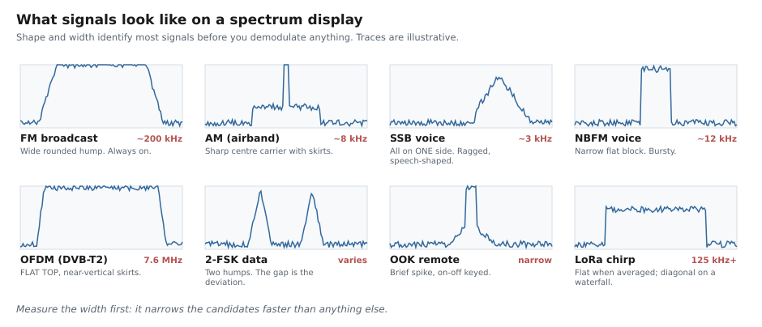

# 🔍 Signal Identification — "What Is That Thing?"

> You have a waterfall full of mysterious blobs. This is how to work out what they are.
>
> **You do not need to decode a signal to identify it.** Width, shape and behaviour narrow it
> down to a handful of candidates before you demodulate anything.

---

## 1. First, learn to read the two displays

Every SDR program shows you the same two things. They show the same data, arranged differently,
and **you need both**.

### The spectrum (FFT) — strength vs frequency

```
   strong │                    ▄▆█▆▄
          │              ▁▂▃▅▇█████▇▅▃▂▁
          │  ▁▁▁▁▁▁▁▁▁▁▁▁▁▁▁▁▁▁▁▁▁▁▁▁▁▁▁▁▁▁▁▁▁▁▁   ← the noise floor
   weak   └──────────────────────────────────────▶
           97.0        97.5        98.0      MHz
```

- **Height** = how strong
- **Width** = how much bandwidth it occupies ← *the single most useful clue*
- **Shape** = a strong hint about the modulation

**It shows you a moment.** A signal that lasts half a second may never appear.

### The waterfall — frequency vs time

```
      frequency ────────────────────────────────▶
   t  │  ████████    ▌            ▂▂▂▂
   i  │  ████████    ▌       ▂▂▂▂▂▂▂▂
   m  │  ████████    ▌   ▂▂▂▂
   e  │  ████████    ▌                  ███
   ↓  │  ████████    ▌                  ███
         constant   thin,      sweeping    burst
         and wide   constant   (a chirp)   (brief)
```

- **A solid vertical band** = something always transmitting (broadcast, a data link)
- **Short blocks** = bursts (airband voice, ADS-B, a remote control)
- **Diagonal streaks** = something sweeping in frequency (radar, LoRa, an ionosonde)
- **A thin bright line** = an unmodulated carrier, or your own LO leakage

> 🎯 **The single most common beginner mistake:** looking only at the FFT. Most of the
> interesting signals in the world are *bursty*, and an averaged FFT hides them completely.
> **Watch the waterfall.**

---

## 2. The shapes



| Looks like | Width | Almost certainly |
|---|---|---|
| Wide rounded hump, never stops | ~200 kHz | **FM broadcast** |
| Sharp centre spike with skirts | ~8 kHz | **AM** — airband, shortwave |
| All energy on **one** side, ragged | ~3 kHz | **SSB** voice |
| Narrow flat block, comes and goes | ~12 kHz | **NBFM** voice |
| **Flat top with vertical sides** | 1.5–8 MHz | **OFDM** — DVB-T2, DAB, Wi-Fi, LTE |
| Two humps with a gap | varies | **2-FSK** data |
| Brief narrow spike, repeating | narrow | **OOK** remote or sensor |
| Diagonal sweep on the waterfall | 125 kHz+ | **LoRa** or a radar |
| Fuzzy blob, no structure | wide | Noise, interference, or a device you own |

---

## 3. The identification procedure

Work through these in order. Each step cuts the candidates down.

### Step 1 — Measure the width

Put the marker on each edge of the signal and subtract. **Do this first, always.**

| Bandwidth | Candidates |
|---|---|
| < 1 kHz | CW/Morse, a beacon, an unmodulated carrier, WSPR |
| 2.5 – 3 kHz | SSB voice, HF data modes |
| 6 – 10 kHz | AM broadcast, airband |
| 10 – 16 kHz | NBFM voice, marine, PMR |
| 12.5 – 25 kHz | DMR, dPMR, NXDN, P25 |
| ~200 kHz | FM broadcast |
| 125 – 500 kHz | LoRa |
| 1.5 MHz | DAB |
| 5 – 20 MHz | Cellular (LTE/5G) |
| 6 – 8 MHz | Digital TV (DVB-T2, ATSC, ISDB-T) |
| 20 MHz+ | Wi-Fi |

### Step 2 — Check the behaviour in time

| Behaviour | Means |
|---|---|
| Constant, never stops | Broadcast, a beacon, a data link, or interference |
| Bursts of seconds | Voice — airband, marine, PMR |
| Bursts of milliseconds | Packet data — ADS-B, AIS, a sensor |
| Regular, clock-like | Telemetry, a beacon, a pager |
| Sweeping | Radar, LoRa, an ionosonde |
| Hops around the band | Frequency-hopping — Bluetooth, some RC |

### Step 3 — Listen in three modes

Even for a data signal, listening tells you a lot. Try **NBFM**, **AM** and **USB** on it:

| Sounds like | Probably |
|---|---|
| Clear speech | Voice, and you found the right mode |
| Ducks / Donald Duck | SSB, tuned slightly off |
| A steady tone | An unmodulated carrier |
| A harsh buzz | Digital voice (DMR, P25, TETRA) |
| Warbling two-tone | FSK data |
| A clean hiss | Noise, or a wideband digital signal |
| Rhythmic chirping | Pager, telemetry, or a beacon |

### Step 4 — Consider *where* it is

**The frequency is usually the biggest clue of all.** Allocations are not random — see
[the Malaysian band table](./04_malaysia.md) or the
[Applications catalogue](../04_applications/README.md).

### Step 5 — Look it up

**[sigidwiki.com](https://www.sigidwiki.com/)** — the Signal Identification Wiki. Spectrograms
and audio samples for hundreds of signals. If you have the width and the behaviour, you will
usually find it there in a minute.

---

## 4. Measuring things properly

### Symbol rate, from the waterfall

Zoom in hard on a burst. If you can see individual symbols, measure the time for N of them:

$$
R_s = \frac{N}{t}\ \text{baud}
$$

**[inspectrum](https://github.com/miek/inspectrum)** does this for you — it overlays a
draggable symbol-period cursor on a recording. It is the right tool and it is free.

### FSK deviation

Measure the gap between the two humps. That gap **is** twice the deviation.

### Occupied bandwidth, honestly

Regulators use the **99 % power bandwidth**, not what looks right by eye. The script in
[`03_scripts/analyze_dvbt2.py`](../03_scripts/analyze_dvbt2.py) shows how to compute it.

---

## 5. Things that are not signals

A surprising fraction of what a beginner finds is generated by their own equipment.

| Appearance | It is |
|---|---|
| **A sharp spike dead centre, follows you when you retune** | Your own **LO leakage / DC offset**. Not a signal. Dodge it by offset tuning ([Lab 06](../02_flowgraphs/lab06_multimode_receiver/README.md)) |
| Evenly spaced spikes across the band, move when you change gain | **Intermodulation** — your front end is overloaded. Turn the gain down |
| A comb of spikes at exact multiples of some frequency | **Harmonics** of a digital clock, usually inside your own PC |
| Broadband hash that vanishes when you unplug something | A switch-mode power supply, an LED lamp, or a phone charger |
| A raised noise floor everywhere, all the time | Local electrical noise. Hunt it down — it is worth more than any antenna upgrade |
| Signals appearing at impossible frequencies | **Aliasing** — you decimated without filtering first |

> 🔌 **A five-minute experiment worth doing once:** switch off every light and charger in the
> room and watch the noise floor. Most people find 10–20 dB of their noise is coming from
> inside their own house.

---

## 6. A worked example — from this repository

When verifying [Lab 08](../02_flowgraphs/lab08_rds_decoder/README.md), a scan of the FM band
looked like this:

1. **Width ~200 kHz, constant, in 87.5–108 MHz** → FM broadcast. Easy.
2. Demodulate and look at the **MPX baseband** — the signal *inside* the FM signal:
   - a strong spike at **19 kHz** → stereo pilot, so the station is in stereo
   - a hump around **38 kHz** → the L−R stereo subcarrier
   - a faint hump around **57 kHz** → **RDS**
3. A crude spectral measurement said the 57 kHz hump was only **+1.9 dB** above noise, and led
   to a confident conclusion of "no RDS in this band".
4. **That conclusion was wrong.** Running the actual decoder recovered **287 CRC-valid groups
   in 30 seconds** — an 84 % success rate — revealing station *BFM 89.9* scrolling
   "BUSINESS" / "FINANCE" in its programme-service name.

> **The lesson:** RDS is transmitted at 2–4 % deviation. It barely dents an averaged FFT while
> being perfectly decodable. **A decoder with a CRC is far more sensitive than your eye on a
> spectrum display.** When you suspect something is there, run the decoder rather than
> squinting harder.

---

## 7. A quick checklist

When you find something unknown, record these six things:

```
  [ ] Centre frequency          ______ MHz
  [ ] Bandwidth                 ______ kHz
  [ ] Constant or bursty?       ______
  [ ] Burst length              ______ ms
  [ ] Repeat interval           ______
  [ ] Spectrum shape            ______ (hump / flat-top / two humps / spike)
```

With those six, sigidwiki or a forum will identify it almost every time. **Also record a few
seconds of IQ** with [Lab 05](../02_flowgraphs/lab05_iq_record_playback/README.md) — a
recording is something you can analyse later and share; a memory is not.

---

**See also:** [Glossary](./01_glossary.md) · [Antennas](./03_antennas.md) ·
[Applications catalogue](../04_applications/README.md) · [Reference index](./README.md)
