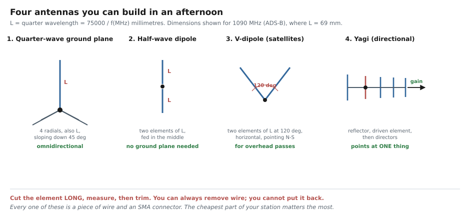

# 📡 Antennas — The Cheapest Part That Matters Most

> **A $40 receiver with the right antenna outdoors beats a $1500 receiver with the wrong
> antenna indoors. Every time.**
>
> This is the highest-value page in the repository for a beginner. Everything here can be built
> from wire, an SMA connector and half an hour.

---

## 1. Why it matters — measured, not asserted

While verifying [Lab 09](../02_flowgraphs/lab09_adsb_receiver/README.md), an attempt was made to
receive ADS-B aircraft at **1090 MHz** using the FM-band whip left over from the earlier labs:

| Antenna port | Gain | Noise floor | CRC-valid aircraft frames |
|---|---|---|---|
| TX/RX | 70 dB | 0.0674 | **0** |
| TX/RX | 76 dB | 0.1279 | **0** |
| RX2 | 70 dB | 0.0669 | **0** |
| RX2 | 76 dB | 0.1205 | **0** |

Raising the gain by 6 dB raised the noise floor by **exactly 6.0 dB** — a perfect 1:1 track.
That is the signature of a receiver hearing nothing but its own noise. **More gain could not
help, because no signal was arriving.**

The decoder was fine. The software was fine. The antenna was the entire problem: an FM whip is
roughly **ten wavelengths long** at 1090 MHz, with a radiation pattern shredded into narrow
lobes and a badly mismatched feedpoint.

The fix costs **69 mm of wire**.

---

## 2. The one equation

$$
\lambda = \frac{300}{f_{\text{MHz}}}\ \text{metres}
\qquad\Longrightarrow\qquad
\boxed{\text{quarter wave (mm)} = \frac{75{,}000}{f_{\text{MHz}}}}
$$

An antenna works best when its size is a **simple fraction of the wavelength** — usually a
quarter or a half. Too short and it barely couples to the wave; too long and the currents fight
each other.

### Cut list

| Band | Frequency | λ | **¼ wave** | ½ wave | 5/8 wave |
|---|---|---|---|---|---|
| 40 m shortwave | 7.1 MHz | 42.3 m | 10563 mm | 21127 mm | — |
| 20 m shortwave | 14.2 MHz | 21.1 m | 5282 mm | 10563 mm | — |
| 6 m amateur | 50 MHz | 6.00 m | 1500 mm | 3000 mm | 3750 mm |
| **FM broadcast** | 98 MHz | 3.06 m | **765 mm** | 1531 mm | 1913 mm |
| Airband | 127 MHz | 2.36 m | **591 mm** | 1181 mm | 1476 mm |
| **Weather satellites** | 137.5 MHz | 2.18 m | **546 mm** | 1091 mm | 1364 mm |
| 2 m amateur | 146 MHz | 2.05 m | **514 mm** | 1027 mm | 1284 mm |
| Marine VHF | 157 MHz | 1.91 m | **478 mm** | 955 mm | 1194 mm |
| NOAA weather radio | 162.45 MHz | 1.85 m | **462 mm** | 923 mm | 1154 mm |
| Radiosondes | 403 MHz | 744 mm | **186 mm** | 372 mm | 465 mm |
| ISM 433 | 433.9 MHz | 691 mm | **173 mm** | 346 mm | 432 mm |
| 70 cm amateur | 435 MHz | 690 mm | **172 mm** | 345 mm | 431 mm |
| PMR446 | 446 MHz | 673 mm | **168 mm** | 336 mm | 420 mm |
| DTT / DVB-T2 | 580 MHz | 517 mm | **129 mm** | 259 mm | 323 mm |
| ISM 919–923 (LoRa) | 921 MHz | 326 mm | **81 mm** | 163 mm | 204 mm |
| **ADS-B** | 1090 MHz | 275 mm | **69 mm** | 138 mm | 172 mm |
| GPS L1 | 1575.4 MHz | 190 mm | **48 mm** | 95 mm | 119 mm |
| ISM 2.4 GHz | 2450 MHz | 122 mm | **31 mm** | 61 mm | 77 mm |

```bash
python3 -c "
f = float(input('frequency in MHz: '))
print(f'wavelength   {300/f*1000:8.1f} mm')
print(f'quarter wave {75/f*1000:8.1f} mm   <- cut this')
print(f'half wave    {150/f*1000:8.1f} mm')"
```

> ✂️ **Cut long, then trim.** Real wire behaves as if slightly longer than the formula says
> (the "velocity factor", about 0.95). Cut 5 % long, test, and shorten a millimetre at a time.
> **You can always remove wire. You cannot put it back.**

---

## 3. Four antennas you can build today



### 3.1 Quarter-wave ground plane — *the default choice*

**Best for:** ADS-B, radiosondes, NOAA weather radio, marine, PMR, any single VHF/UHF band.
**Pattern:** omnidirectional — hears equally in all horizontal directions.

**Parts:** a female SMA panel connector, ~5 × stiff wire (a coat hanger, a brass rod, or the
copper from mains cable), solder.

**Build:**
1. Cut **one** element to ¼ wave. Solder it to the connector's **centre pin**, pointing up.
2. Cut **four** radials, also ¼ wave. Solder them to the connector's **body** (the ground).
3. Bend the radials **down at about 45°**. This raises the feedpoint impedance to roughly 50 Ω,
   which is what your coax and SDR expect.

```
             │  ← ¼ wave, vertical
             │
             │
      ╲      │      ╱
       ╲     │     ╱        4 radials, each ¼ wave,
        ╲    │    ╱         sloping down ~45°
         ╲   ●   ╱          ● = SMA connector
```

**For ADS-B that is 69 mm up and 4 × 69 mm down.** It takes fifteen minutes and it will
transform your results.

### 3.2 Half-wave dipole — *when there is no ground*

**Best for:** FM broadcast, general listening, hanging in a window.
**Pattern:** omnidirectional in the plane perpendicular to the wire; deaf off the ends.

**Build:** two elements, each **¼ wave**, in a straight line, fed in the middle — one to the
coax centre, one to the braid. Total length is therefore a **half** wave.

No ground plane needed, which is why it is the easiest thing to hang indoors.

### 3.3 V-dipole — *for satellites*

**Best for:** anything in a low orbit passing overhead — weather satellites, the ISS, cubesats.
**Pattern:** aimed upward, covering most of the sky.

**Build:** exactly a dipole, but bent into a **V at 120°**, mounted **horizontally**, with the
V pointing **north–south**.

For 137.5 MHz satellites: two elements of **546 mm** at 120°. Cost: a coat hanger.

> This is the antenna that makes weather-satellite reception work, and it is the single best
> value-for-effort build in this document.

### 3.4 Yagi — *when you know where to point*

**Best for:** a distant repeater, direction finding, hunting interference.
**Pattern:** strongly directional — that is the point.

**Build:** a boom carrying, in order: a **reflector** (~5 % longer than a half wave), a **driven
element** (a half-wave dipole, where the coax attaches), then **directors** (~5 % shorter),
spaced roughly 0.15–0.2 λ apart. More directors = more gain and a narrower beam.

Use an online Yagi calculator for the exact dimensions — the interactions are fiddly and not
worth deriving by hand.

### 3.5 Others worth knowing

| Antenna | Best for | Why |
|---|---|---|
| **Discone** | Wideband scanning | Works across a 10:1 frequency range. Buy rather than build |
| **QFH (quadrifilar helix)** | Weather satellites | Better than a V-dipole, harder to build. Circularly polarised |
| **Loop** | HF, direction finding, indoors | Small, nulls out local electrical noise |
| **Long wire** | HF general listening | Literally a long wire plus an impedance transformer |
| **Patch** | GPS, satellites | Flat, circularly polarised. **Active GPS patches include an LNA and need bias power** |

---

## 4. Placement beats everything

In order of how much difference it makes:

| Priority | Action | Typical gain |
|---|---|---|
| **1** | **Get it outside** | 10–20 dB. Walls, especially with foil insulation, are brutal |
| **2** | **Get it high** | Every metre extends the radio horizon |
| **3** | **Clear the sky** in the direction you care about | Line of sight is not optional above 100 MHz |
| **4** | **Away from noise** — LED lights, chargers, solar inverters, routers | Can be 20 dB of noise floor |
| **5** | Correct polarisation — vertical for most VHF/UHF, horizontal for satellites/SSB | Up to 20 dB if wrong |

$$
d_{\text{horizon, km}} \approx 3.57 \sqrt{h_{\text{metres}}}
$$

At 2 m above ground you can see ~5 km; at 10 m, ~11 km. For an aircraft at 10,000 m, **the
aircraft's** height dominates and you can reach 400 km — *if nothing is in the way*.

---

## 5. Coax and connectors

The cable matters more at high frequencies than beginners expect.

| Cable | Loss at 100 MHz | Loss at 1 GHz | Use |
|---|---|---|---|
| RG-174 (thin) | 0.3 dB/m | 1.1 dB/m | Very short patch leads only |
| **RG-58** | 0.16 dB/m | 0.6 dB/m | Short runs, VHF |
| **RG-6** (satellite TV) | 0.07 dB/m | 0.22 dB/m | **Cheap, good, widely available.** Use this |
| LMR-240 | 0.06 dB/m | 0.20 dB/m | Better, more expensive |
| LMR-400 | 0.03 dB/m | 0.11 dB/m | Long runs, UHF and above |

> 📏 **10 m of RG-58 at 1090 MHz loses 6 dB** — you have thrown away three quarters of your
> signal before it reaches the radio. Either keep the cable short, use better cable, or put an
> **LNA at the antenna** so the loss happens after amplification ([Friis, Fundamentals 06](../01_fundamentals/06_noise_snr_and_gain.md)).

**Connectors:** your SDR uses **SMA female**. Adapters to BNC, N and F are cheap. Keep them
finger-tight — SMA connectors are easily damaged by over-tightening, and a bad connector looks
exactly like a bad antenna.

---

## 6. Do I need an amplifier?

**Usually no. Sometimes dramatically yes.**

The test takes thirty seconds:

1. Note the noise floor on your spectrum display.
2. Raise the RF gain by 6 dB.
3. Watch the noise floor.

| Result | Meaning | Action |
|---|---|---|
| Noise floor rises ~6 dB | You are **front-end noise limited** | More gain is useless. An LNA **at the antenna** may help. Check the antenna first |
| Noise floor barely moves | You are **gain starved** | Keep raising the gain — it is free |

An LNA only helps if it is **at the antenna**, before the cable loss. An LNA at the receiver end
amplifies the loss along with the signal and achieves almost nothing.

> ⚡ **Many LNAs need bias power** (3–5 V) sent up the coax. Your SDR does **not** supply it —
> you need a bias tee. Active GPS antennas are the most common case.

---

## 7. Filters — when more is less

If you live near a broadcast transmitter, a **filter can help far more than an amplifier**. A
strong out-of-band signal overloads the front end and desensitises the receiver across the whole
spectrum.

| Filter | Use |
|---|---|
| **FM band-stop (notch)** | Essential near broadcast transmitters if you want anything else on VHF |
| **Band-pass for your target** | e.g. 1090 MHz for ADS-B. Often sold together with an LNA |
| **DC block** | Protects against stray voltage on the coax |

**Symptom that you need one:** signals appear at the wrong frequencies, or the noise floor rises
when a strong local station starts transmitting.

---

## 8. Test it

Before blaming your software:

1. **Continuity check.** A multimeter across the SMA should read *open* for a dipole, or
   *short* for a ground plane (the element is DC-connected to the radials through nothing —
   actually open; a short means you have a solder bridge). Either way, **a short circuit is
   always a fault.**
2. **Compare.** Note the signal strength of one strong station, swap antennas, note it again. A
   real A/B test beats any amount of theory.
3. **The sweep test.** Point at a known signal and move the antenna around. If nothing changes,
   it is probably not connected.
4. **Use a NanoVNA** (~$50) if you get serious. It will show you the resonant frequency and the
   SWR directly, and it turns antenna building from guesswork into measurement.

---

## 9. What to build first

| If you want to... | Build | Time | Cost |
|---|---|---|---|
| Do Labs 01–08 (FM) | A 765 mm wire, or the supplied whip | 1 min | $0 |
| Track aircraft ([Lab 09](../02_flowgraphs/lab09_adsb_receiver/README.md)) | **69 mm ground plane** | 20 min | ~$3 |
| Receive weather satellites | **546 mm V-dipole** | 20 min | ~$3 |
| Chase radiosondes | 186 mm ground plane | 20 min | ~$3 |
| Listen to everything | A discone (buy it) | 0 min | ~$60 |
| Hunt interference | A Yagi for the band | 1 hour | ~$10 |

---

**See also:** [Glossary](./01_glossary.md) · [Signal identification](./02_signal_identification.md) ·
[Fundamentals 06 — Noise & SNR](../01_fundamentals/06_noise_snr_and_gain.md) ·
[Reference index](./README.md)
